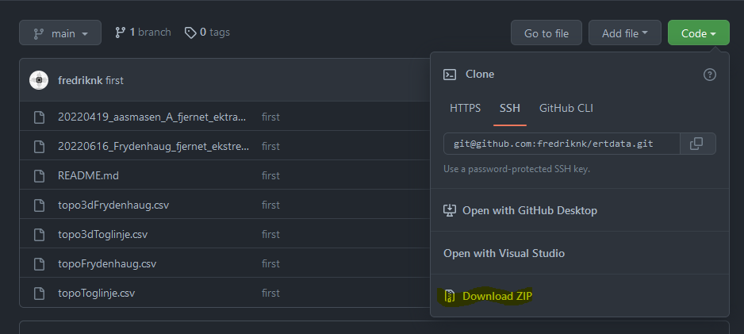

# Resipy

PROSYS (Iris instruments downlaod syscal data)

### Resipy

Last ned ferdig kompilert versjon av resipy fra [https://gitlab.com/hkex/resipy](https://gitlab.com/hkex/resipy) og kjør.

Hvis du har mac/linux så må du installere wine først for å kunne kjøre programmet

Last ned datasett fra [https://github.com/fredriknk/ertdata](https://github.com/fredriknk/ertdata)

Hvis du kan bruke GIT, SUPERT! Evt trykk på Code->Download Zip og unzip filen der du vil ha den.

Åne Resipy, og velg resinv (2d/3d) som filformat, deretter trykk import data (velg “20220616_Frydenhaug_fjernet_ekstre_punkt.dat”)

Se at data ser fornuftig ut og velg “Electrodes (X/Y/Z/Topo)”

Trykk på “Import from CSV “files with headers: .. ……” og velg den tilhørende gps filen. Topofilen må ha eksakt like mange punkter som ERT filen. For å gjøre dette har jeg et eget pythonscript på https://github.com/fredriknk/Resipy_interpolate som interpolerer data fra gps punkter og henter høydedata fra DTM Kart.

Når du har lastet inn topografisk data, sjekk at profilen din fortsatt ser fornuftig ut ved å trykke på “Data”. Hvis du har unøyaktige gps målinger risikerer du å få ganske rar profil (Prøv  20220617_asmasen_tog_mindre_ekstra_data_fjernet_ekstra_data.dat med topoToglinje_Alle_Punkter.csv topofilen for å se eksempelet under: ) Når du har lastet inn topografisk data, sjekk at profilen din fortsatt ser fornuftig ut ved å trykke på “Data”. Hvis du har veldig gps målinger som er ukorrekte risikerer du å få ganske rar profil

Dette kommer av at det er tatt GPS posisjoner uten god Fix, (Se to som gjør at feks elektrode 30-45 er alt for nærme hverandre, mens elektrode 20-30 er for langt fra hverandre. For å fikse dette valgte jeg å kun bruke første/siste gps posisjon i interpoleringen. Hvis det feks hadde vært en knekk i elektrodemålingen ville jeg hatt med det punktet. 

Mens hvis det er riktig avstand mellom punkter ser det mer ut som dette:

I “Pre-processing” fanen kan du velge å fjerne punkter med høy “reciprical error” ved å sette en threshold og trykke på “Apply Filters”. Du kan lagre den filtrerte datfilen (Du får også med topodata i datfilen ved å velge save data) 

Gå til “Inversion” fanen og klikk på “Invert”

 etter et minutt eller to med iterasjoner får du opp et ferdig plott. Her har du en del valg.

1. Du kan velge mellom forskjellige ting du kan plotte 
    1. Resistivity Ohm/m
    2.  Resistsivity log10 (resistiviteten log plottet)
    3. Sensitivity Log10 (sensitiviteten på målingen)
    4. Conductivity Ms/m (konduktivitet
2. Min/Max verdi for plotting, du kan endre disse verdiene for å se tydligere skiller i plottet ditt. Trykk apply (3) for å endre plottet. På windows 11 maskiner er det ikke mulig å skrive desimaltall, de jobber med dete problemet
3. Trykk her for å legge inn min max verdien i plottet
4. Valg av fargeskjema (se [https://matplotlib.org/stable/tutorials/colors/colormaps.html](https://matplotlib.org/stable/tutorials/colors/colormaps.html) for eksempel, eller bare prøv deg frem)
5. Velg Conturplott
6. Velge synligheten av sensitivitetsdata
7. Velge om x og y akse skal ha lik størrelse (plottet blir høyere med den avskrudd)
8. Lagre plottet som blir vist, man kan også bruke save data, men det lagrer en del ekstra info som man kan bruke i feks python for å jobbe videre med

Man kan også lagre hele prosjektet med Options→Save Project til en “.resipy” fil. Denne kan lastes inn igjen senere når man skal jobbe med prosjektet.

